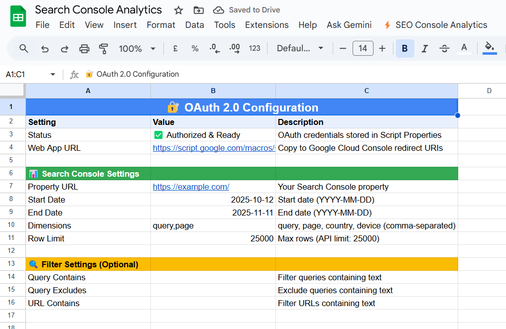
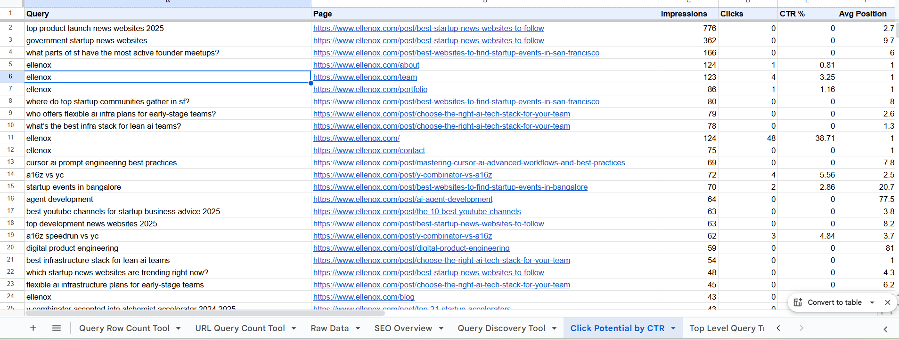

# Google Sheets Search Console SEO Apps Script

A Google Apps Script that connects Google Sheets with the Google Search Console API to fetch SEO data and run quick analyses automatically.

## Features
- Secure OAuth 2.0 authorization
- Fetch up to 25,000 rows of Search Console data
- Built-in instruction menu and sheet-based customization (no code changes needed)
- Tools included:
  - Query Row Count Tool
  - URL Query Count Tool
  - SEO Overview Dashboard
  - Query Discovery Tool
  - Click Potential by CTR
  - Top Level Query Trajectory

  
  

## Setup
1. Open Google Sheets → Extensions → Apps Script
2. Copy and paste this script
3. Deploy as Web App (for OAuth)
4. Enter OAuth credentials in the sheet
5. Fetch data and view the analysis

## Enable OAuth 2.0 for Google Search Console API

### 1. Go to Google Cloud Console
Open [https://console.cloud.google.com/](https://console.cloud.google.com/)  
Sign in with the same Google account used for your Google Sheet.

### 2. Create a New Project
1. Click the **Project Selector** at the top.
2. Click **New Project**.
3. Name it something like **Search Console Sheets Integration**.
4. Click **Create**, then wait a few seconds.
5. Make sure the new project is selected in the top bar.
6. 
### 3. Enable the Search Console API
1. In the left sidebar, go to **APIs & Services → Library**.
2. Search for **Search Console API**.
3. Click it and press **Enable**.

### 4. Create OAuth 2.0 Credentials
1. Go to **APIs & Services → Credentials**.
2. Click **+ CREATE CREDENTIALS → OAuth client ID**.  
   If prompted to configure the consent screen, do that first (next step).

### 5. Configure OAuth Consent Screen
1. Choose **External** as the user type.
2. Click **Create**.
3. Fill in the required fields:
   - **App name:** e.g., Search Console Sheets Script
   - **User support email:** your own Gmail
   - **Developer contact info:** your email again
4. Click **Save and Continue** through the next screens.
5. Under **Test users**, add your own Google account email.
6. Click **Save and Continue → Back to Dashboard**.

### 6. Create OAuth Client ID
1. Go to **APIs & Services → Credentials → + CREATE CREDENTIALS → OAuth client ID**.
2. Choose **Application type: Web application**.
3. Name it, for example: **Sheets Search Console OAuth**.
4. Under **Authorized redirect URIs**, click **Add URI**.
5. Paste your **Web App URL** (from your Apps Script deployment), for example: https://script.google.com/macros/d/AKfycbxxxxxxxxxxxxxxxx/exec
6. Click **Create**.

### 7. Copy Your OAuth Credentials
After creation, copy:
- **Client ID**
- **Client Secret**

You’ll use these in your Google Sheet via the **OAuth Setup → Enter OAuth Credentials** menu.

### 8. Deploy the Apps Script as a Web App
1. Open your Google Sheet → **Extensions → Apps Script**.
2. Click **Deploy → New Deployment**.
3. Select **Web App** as the deployment type.
4. Configure:
- **Execute as:** Me (your account)
- **Who has access:** Anyone
5. Click **Deploy** and copy the **Web App URL**.
6. Add this URL to the **Authorized Redirect URIs** in the Cloud Console (step 6).

### 9. Paste Credentials in the Sheet
1. Open the custom menu in your sheet: **OAuth Setup → Enter OAuth Credentials**.
2. Paste:
- Client ID
- Client Secret
- Redirect URI (your Web App URL)
3. Save the credentials.

### 10. Authorize the Script
1. Go to **OAuth Setup → Generate Auth URL**.
2. Click the generated link.
3. Sign in with your Google account and allow permissions.
4. Once approved, you’ll see a success message confirming authorization.

### 11. Test the Connection
In your sheet, use **OAuth Setup → Test Connection**.  
If successful, the script can now fetch Search Console data securely.

### 12. Common Issues

| Problem | Cause | Fix |
|----------|--------|-----|
| Redirect URI mismatch | The URL in Cloud Console doesn’t exactly match the Web App URL | Copy the Web App URL again and update it in Cloud Console |
| Access blocked error | Consent screen not verified or user not added as Test User | Add your email under Test Users in the Consent Screen |
| API not enabled | Search Console API was not turned on | Go to API Library and enable it manually |

Once everything is configured, your Google Apps Script can securely connect to the Search Console API, fetch data, and run automated analyses directly inside Google Sheets.
